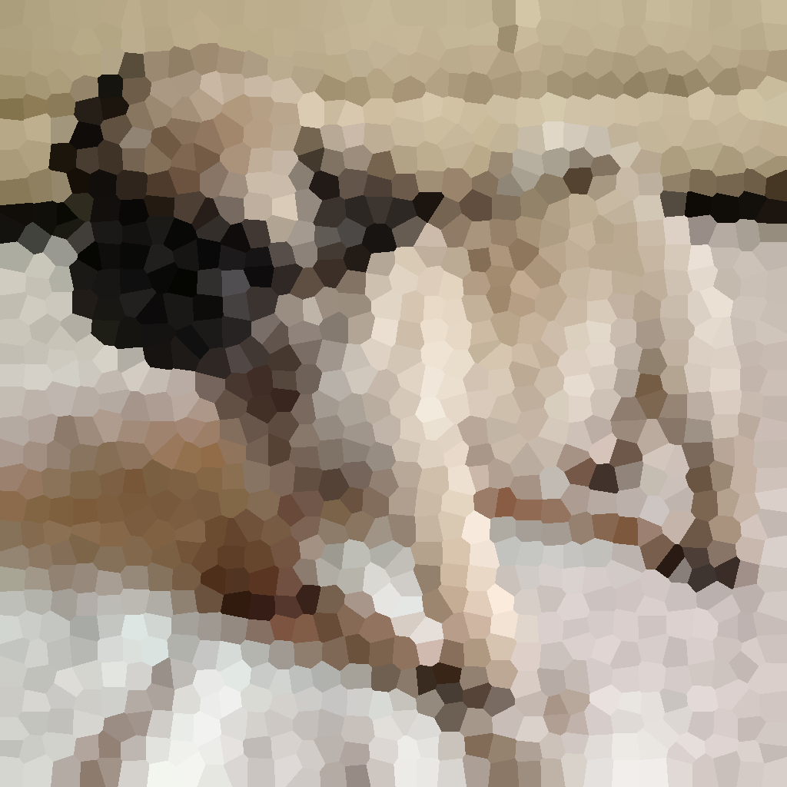

# SLIC + Voronoi (Computational geometry)
<body>
		<header>
			<h3>Geometría computacional</h3>
			<ul>
				<li><b>Proyecto Final:</b> SLIC + Voronoi = Superpixeles Voronoi</li>
				<li><b>Alumno:</b> Rodolfo Ferro Pérez </li> 
			</ul>
		</header>
		<h1>Read Me! Me! Me!</h1>
			<h2>1. Acerca de...</h2>
			<ul>
				<li>El proyecto surge al tratar de responder la siguiente pregunta:
					   <i>"¿Cómo puedo guardar ciertos datos de una imagen y reconstruir con una buena aproximación a la imagen original?"</i>  
					Al final, la idea que surge es segmentar usando SLIC y debido a los datos que obtenemos, reconstruir utilizando celdas poligonales de Voronoi.
				</li> 
				<li>El procedimiento general de edición de la imagen es el siguiente:  
					<table>
						<tr>
							<td></td>
						</tr>
					</table>
					 
					La parte de preproceso consta de suavizados de la imagen y considerar valores de aproximaciones de gradientes para detectar bordes y evitar malas posiciones iniciales de nuestro SLIC.</li> 
					<li>Más detalle en la <a href="SLICVoronoi.pdf">presentación</a>.</li></ul>
			 
			<h2>2. Corriendo el script</h2>
			<ul>
				<li>El script ya cuenta con parametros inicializados por default, pero también tiene un <i>parser</i> para recibir argumentos desde consola. </li> 
				<li>Los argumentos que el programa puede recibir son:
					<table width="70%" style="margin:20px;">
						<tr>
							<td><code>-k</code>, <code>--clusters</code></td>
							<td>Número de clusters en los que se seccionará la imagen, considerando una cuadriculación cuadrada del entero ingresado. El valor por default es <code>4</code>.</td>
						</tr>
						<tr>
							<td><code>-it</code>, <code>--iterations</code></td>
							<td>Número de iteraciones que se usará para el método de SLIC. El valor por default es <code>1</code>.</td>
						</tr>
						<tr>
							<td><code>-n</code>, <code>--name</code></td>
							<td>Nombre de la imagen a procesar. El formato debe ser <code>.jpg</code> y no hace falta introducir la extensión con el nombre. El valor por default es <code>frog</code>.</td>
						</tr>
						<tr>
							<td><code>-f</code>, <code>--factorsize</code></td>
							<td>Factor de reconstrucción de la imagen original con celdas de Voronoi. El valor por default es <code>2</code>, es decir, el doble de tamaño de la imagen original.</td>
						</tr>
					</table>
				</li> 
				<li>El programa se corre desde consola como sigue: </li> 
				<section>
					<code class="comment">Estando en la carpeta <code>geocomp</code> se encuentra el script llamado <code>slic_voronoi.py</code>.</code> 
					<code class="comment">Corremos el script como usualmente, poniendo o no parámetros.</code>  
					<code class="comment">Ejemplo sin añadir parámetros:</code>
					<section class="console">
						<code class="sys">user@system: </code><code class="command">~/path/geocomp > python slic_voronoi.py</code> 
					</section>  
					<code class="comment">Ejemplo añadiendo parámetros:</code>
					<section class="console">
						<code class="sys">user@system: </code><code class="command">~/path/geocomp > python slic_voronoi.py -k 32 -n pug -it 1 -f 4</code> 
					</section>
				</section> 
				<li>El script puede ser consultado <a href="slic_voronoi.py">aquí</a>.</li></ul>
			 
			<h2>3. Resultados</h2>
			<ul>
				<li>Para el ejemplo con parámetros (de la sección anterior), tenemos los siguientes resultados: 
					[Presiona la imagen para abrirla]  
					<table width="80%">
						<tr>
							<td> Imagen original (256x256)</td>
							<td></td>
						</tr>
						<tr>
							<td></td>
							<td>SLIC + Voronoi (reconstruida a 1024x1024)</td>
						</tr>
					</table>
				</li>
				<li>La carpeta con las imagenes usadas y resultantes está <a href="imgs/">aquí</a>.</li>
			</ul>
	</body>
